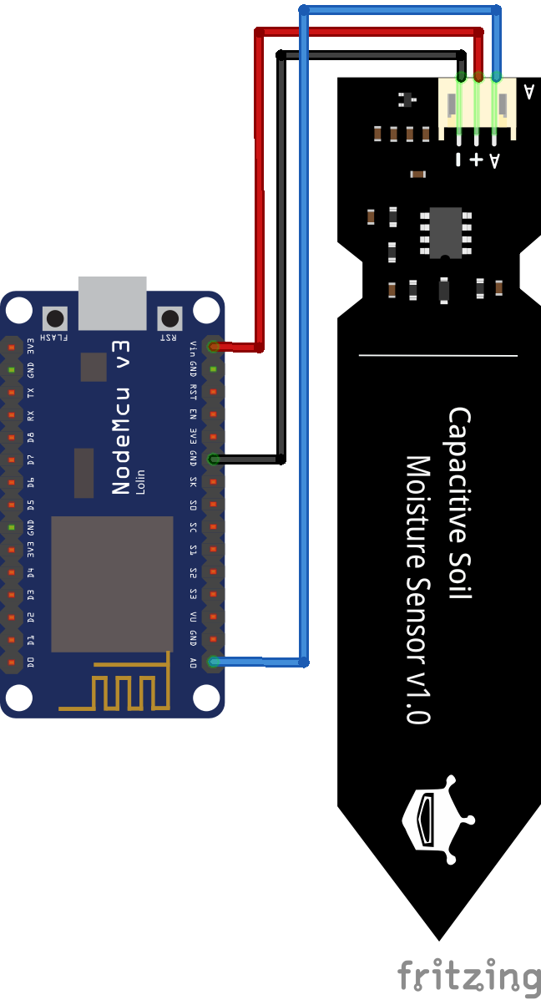

# Garden Monitor

## Summary
This is a garden monitor using various sensors to talk back to a device, probably a raspberry pi. The first sensors will be capacative moisture sensors to tell how wet soil is. The plan is to allow for other sensors such as humidity, soil PH, etc. 

## Moisture Sensors
These will be using capacative soil sensors atied to an ESP8266. This ESP should communicate with the "server" to upload current readings.

### Hardware
 - ESP8266 flashed with MicroPython
 - Capacative soil sensor

### Wiring

### Software/Libraries
 - MicroPython
 - WifiManager (https://github.com/tzapu/WiFiManager)

## Server
The server should accept and store readings from the sensors and provide a dashboard to see historical and current readings. 

### Hardware
In theory this will probably run on any Linux system but will be specifically targetting Raspberry Pi for now. Will test with a Raspberry Pi B 3 and 4. Would be nice to make it lightweight enough to run on a Pi Zero.

### Software/Libraries
Backend should be capable of running in a container. Would like to write this in Rust for the sole purpose of me wanting to learn it. 
Frontend will probably be some sort of JS as that usually goes.a

## TODO
 - Learn how to use ESP8266 with capacative soil sensors
 - Figure out best way for ESP to communicate readings with server
 - Set up server accordingly